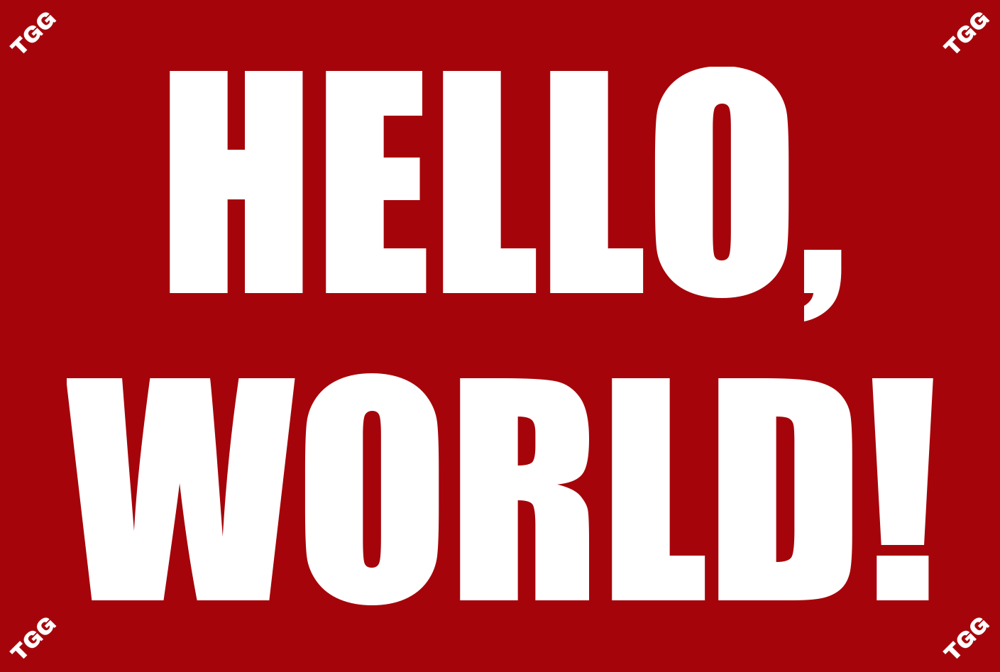

# **Text Graphic Generator**

## **Description**

This project provides the functionality to generate high quality, bicolor, social-media-friendly text graphics in a simple [Flask](https://flask.palletsprojects.com/en/1.1.x/)/JavaScript web app.

## **Workflow**

With the help of [PDM](https://pdm.fming.dev/) and [Make](https://www.gnu.org/software/make/manual/html_node/Introduction.html), managing and working within this repo are very simple.

### **Setting Up Development Environment**

- clone the repo and `cd` into it
- run the command **`make setup`** to create a [PDM](https://pdm.fming.dev/) environment with all the required Python packages installed

### **Testing Web App**

- run the command **`make test`** to start the [Flask](https://flask.palletsprojects.com/en/1.1.x/) app ([app.py](public/app.py)) in development mode
- open a browser and go to http://localhost:5000/

## **Implementation Details**

### **[TextFunctions.py](public/TextFunctions.py)**

- contains text-processing functions to check input validity, format input, and apply automatic text-wrapping to input

### **[GraphicFunctions.py](public/GraphicFunctions.py)**

- assumes all image variables and parameters are either [PIL Images](https://pillow.readthedocs.io/en/stable/reference/Image.html) or [Numpy arrays](https://www.numpy.org/devdocs/reference/generated/numpy.array.html) of the [RGB color model](https://www.geeksforgeeks.org/computer-graphics-the-rgb-color-model/)

### **[variables.py](public/variables.py)**

- is somewhat customizable if you want to change watermark files, adjust text settings, or add color templates
